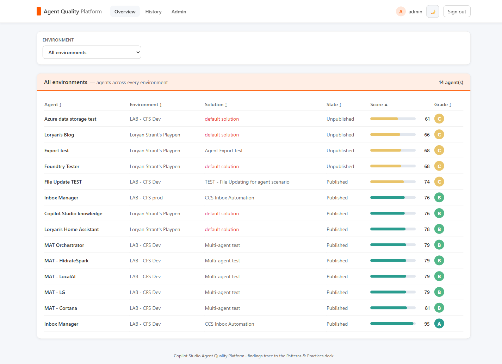
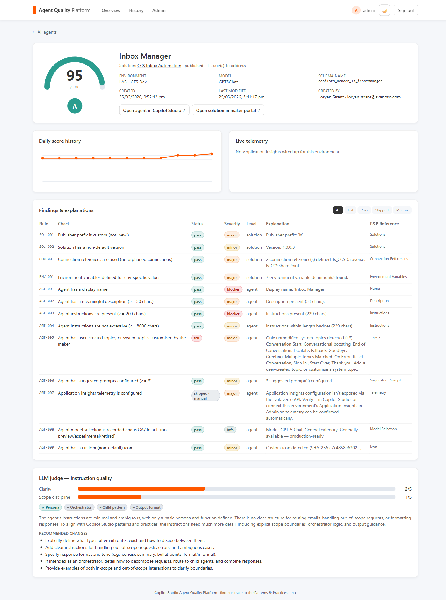
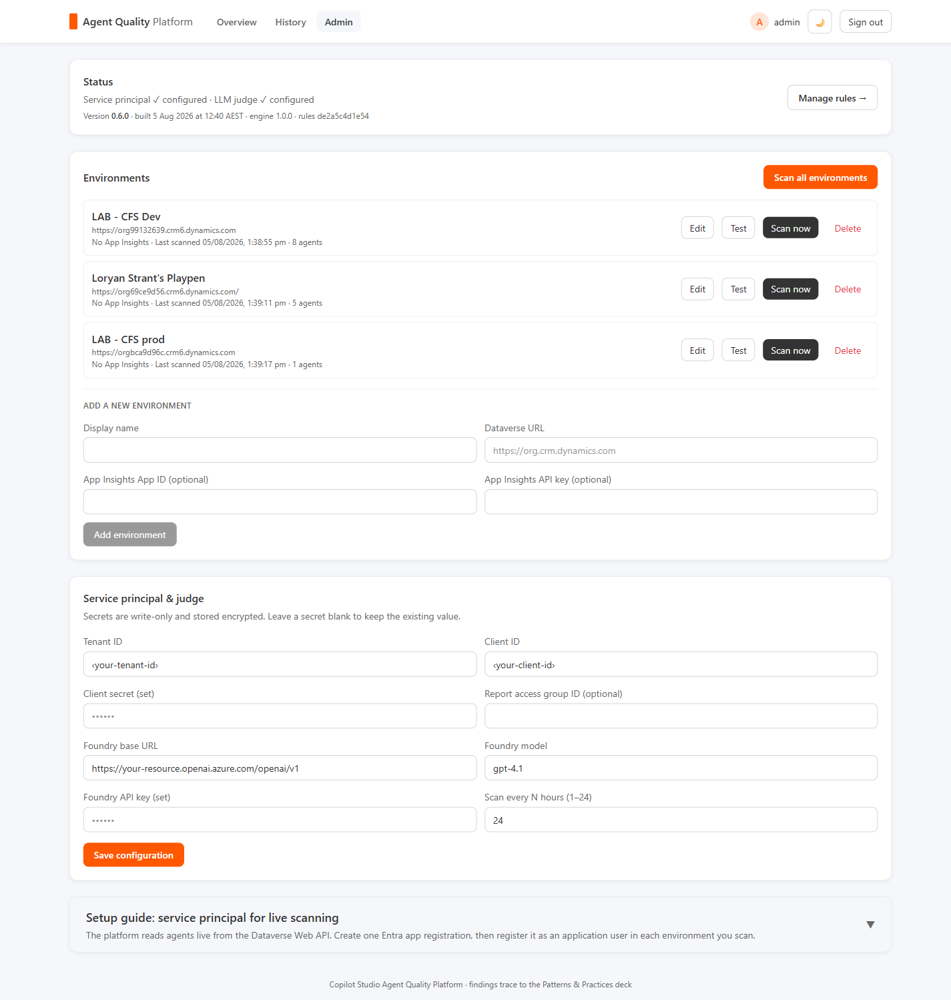
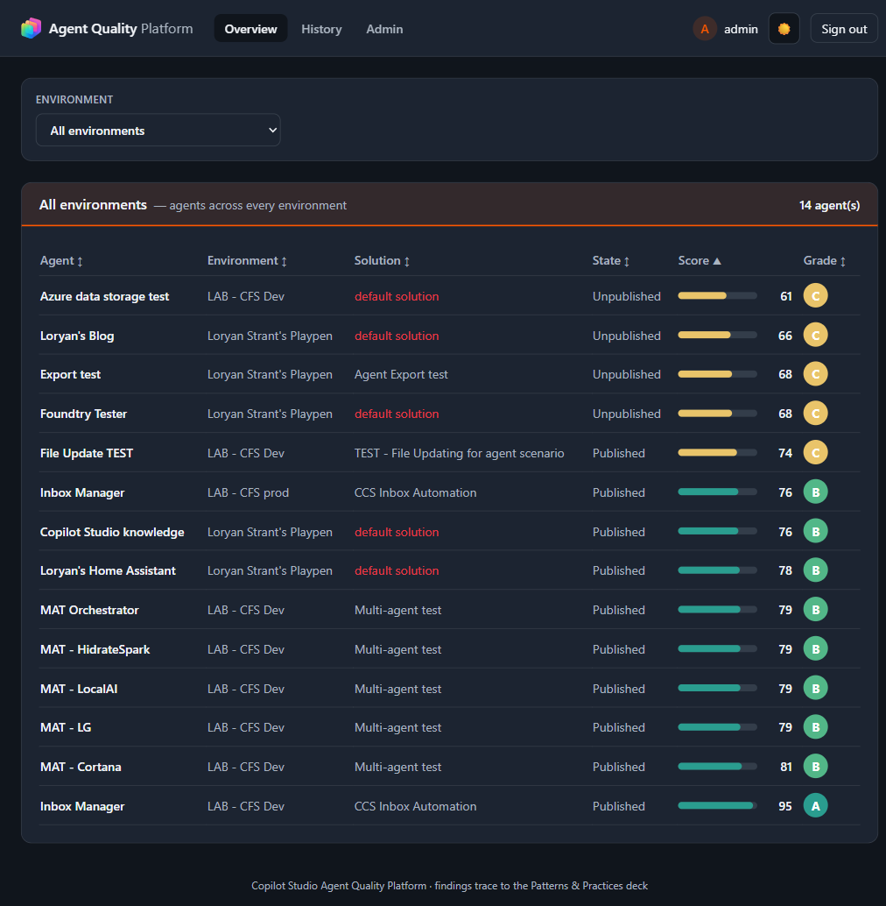

# Copilot Studio Agent Quality Reporter

A self-contained, containerised platform that scores the quality of your **Microsoft Copilot Studio agents** against a catalogue of patterns & practices — and serves it as a modern web dashboard instead of a static report.

It reads your agents **live from the Dataverse Web API** (app-only / client credentials), applies a weighted rule catalogue plus an optional LLM "instruction quality" judge, and presents per-agent scorecards, findings, and history across all of your Power Platform environments. Runs anywhere via Docker and deploys to Azure Container Apps with one click.

## Deploy to Azure (one click)

[](https://portal.azure.com/#create/Microsoft.Template/uri/https%3A%2F%2Fraw.githubusercontent.com%2Floryanstrant%2FAgentQualityReporter%2Fmain%2Finfra%2Fazuredeploy.json/createUIDefinitionUri/https%3A%2F%2Fraw.githubusercontent.com%2Floryanstrant%2FAgentQualityReporter%2Fmain%2Finfra%2FcreateUiDefinition.json)

The button provisions everything into a resource group of your choice: a PostgreSQL flexible server, a Container Apps environment, and the **api** + **worker** container apps (pulled as prebuilt public images from GitHub Container Registry). You only enter an **admin password** — the database password and encryption keys are generated for you. When the deployment finishes, open the `dashboardUrl` output, sign in, and complete the in-app **Admin** page to connect your Dataverse service principal.

> **Maintainers:** the button relies on public images. After the first run of the
> **Publish container images** workflow, set both GHCR packages
> (`agentqualityreporter/api` and `.../worker`) to **Public** once, so Container Apps can pull
> them anonymously. See [`docs/deploy.md`](docs/deploy.md) for the full walkthrough.

## Screenshots

### Overview — every agent, every environment

Pick an environment from the selector, or leave it on **All environments** to see every agent across your tenant, sorted by score. Each row shows the owning solution (display name), publish state, score bar, and grade.



### Agent scorecard

A full breakdown for one agent: score gauge, metadata (created/modified, human creator, model, environment), deep links straight into **Copilot Studio** and the **maker portal**, every rule finding with its explanation and patterns-&-practices reference, live telemetry (when App Insights is connected), and the LLM instruction-quality judge.



### Admin

Password-protected console: manage environments (add, **edit**, test, scan, delete), scan all environments at once, configure the Dataverse service principal and LLM judge, and open the editable rules catalogue. The version/build stamp and a guided setup wizard live here too.



### Dark mode

Every page supports a light and dark theme.



## What it scores

Findings come from a **rule catalogue** ([`engine/rules/rule-catalogue.md`](engine/rules/rule-catalogue.md)) that maps each rule back to a patterns & practices reference. Rules are grouped into:

- **Solution hygiene** — the agent lives in a custom solution (not the default), a custom publisher prefix, a non-default version, connection references instead of hardcoded connections, and environment variables for env-specific values.
- **Agent configuration** — display name, meaningful description, substantive (but not excessive) instructions, user-created or customised topics, suggested prompts, Application Insights, a GA/default model, and a custom icon.
- **Instruction quality (LLM judge, optional)** — clarity, persona, scope discipline, orchestrator/child patterns, and output-format guidance, scored by an Azure OpenAI / Foundry model against the instructions.

Every rule is **editable** from the Rules page: enable/disable it, change its scoring weight, or reword its explanation. Scores are `100 − Σ(weights of failed rules)`, graded A ≥ 90, B ≥ 75, C ≥ 60, D ≥ 40, F below.

> **Application Insights (AGT-007):** Copilot Studio stores the App Insights connection outside Dataverse, and its bot-management API rejects app-only tokens, so a service-principal scan can't read it. This rule is therefore **manual-review** — it never fails on absence. Connect an environment's App Insights in Admin and telemetry is confirmed automatically.

## Stack

- **Backend / engine:** Python 3.12, FastAPI, SQLAlchemy 2.x (async), Alembic, httpx, MSAL,
  APScheduler, Pydantic v2, psycopg v3.
- **Database:** PostgreSQL 16 (schema via Alembic).
- **Frontend:** React + Vite + TypeScript + Tailwind.
- **Packaging:** Docker + docker-compose. Deploy: one-click ARM (GHCR images) or `azd` + Bicep → Azure Container Apps.

## Repo layout

```
/api         FastAPI: routes, auth, admin, reports, serves the built frontend
/worker      live Dataverse collector, scan runner, scheduler, App Insights telemetry
/engine      rule catalogue + scoring engine + LLM judge (the quality "brain")
/shared      SQLAlchemy models, db session, config, crypto, migrations helper
/frontend    React + Vite app
/infra       one-click ARM template + createUiDefinition + Bicep (azd)
/tests       pytest
docker-compose.yml
.env.example
```

## Quick start (local)

```powershell
# 1. Create your env file and a Fernet key
Copy-Item .env.example .env
python -c "from cryptography.fernet import Fernet; print(Fernet.generate_key().decode())"
# paste the printed value into FERNET_KEY in .env

# 2. Start the full stack (api + worker + postgres + frontend)
docker compose up --build
```

- **Dashboard (web UI):** http://localhost:5173
- **API + Swagger docs:** http://localhost:8000/docs
- **API health check:** http://localhost:8000/health
- **Postgres:** localhost:5432 (user/pass/db all `agentquality` by default)

> **Custom ports:** if 5432 / 8000 / 5173 clash with another stack, set `DB_PORT`,
> `API_PORT`, and/or `FRONTEND_PORT` in `.env` before `docker compose up`. Only the
> host-side ports change; the container-internal ports (and the deployed Azure app)
> are unaffected. For example `FRONTEND_PORT=5273` serves the dashboard at
> http://localhost:5273.

On first start an admin login is seeded from `ADMIN_USERNAME` / `ADMIN_PASSWORD`
in `.env` (defaults `admin` / `change-me` — change these). Sign in, open **Admin**,
add an environment (its Dataverse URL), enter your service-principal credentials,
**Test connection**, then **Scan now** (or **Scan all environments**).

## First-run checklist

1. `docker compose up` (or deploy to Azure).
2. Sign in with `ADMIN_USERNAME` / `ADMIN_PASSWORD` (seeded on first start).
3. **Admin** → follow the guided setup wizard to create one Entra app registration and
   register it as an application user in each environment.
4. Enter Tenant ID, Client ID, Client Secret, and (optionally) the Azure OpenAI / Foundry
   base URL, model, and key for the LLM instruction judge.
5. **Add environment** → paste its Dataverse org URL → **Test** → **Scan now**.
6. Explore the dashboard; open an agent to see its full scorecard.

The Dataverse app registration needs the **Dynamics CRM `user_impersonation`** application
permission and must be added as an **application user** with a security role that can read
bots, bot components, and solutions in each environment you scan.

## Authentication

- **Admin console** is always **password-protected** (JWT, seeded admin user).
- **Entra single sign-on (optional)** — when enabled at deploy time, Azure Container Apps
  Easy Auth gates the dashboard behind Microsoft Entra ID so licensed users can view it with
  their work account. See [docs/deploy.md](docs/deploy.md#entra-single-sign-on-optional).

## Running tests

```powershell
pip install -e ".[dev]"
pytest
```

Tests run against an isolated SQLite database (no Postgres required). Inside the
running stack you can also run `docker compose exec api python -m pytest`.

## Deploy to Azure (azd, build from source)

Prefer building from source instead of the one-click images? Infrastructure is defined in
`/infra` and `azure.yaml`.

```powershell
azd env set POSTGRES_ADMIN_PASSWORD "<strong-password>"
azd env set FERNET_KEY "<fernet-key>"
azd env set SECRET_KEY "<random-secret>"
azd env set ADMIN_PASSWORD "<admin-password>"

azd up      # provision + build + deploy
azd down    # tear everything down
```

The API container serves the built React bundle, so the deployed app is a single
public endpoint. Swap `DATABASE_URL` to any Postgres to move the database.

> `FERNET_KEY` may be any non-empty string — a proper Fernet key is used as-is, anything else is
> hashed into a valid key. This is what lets the one-click template auto-generate it.
